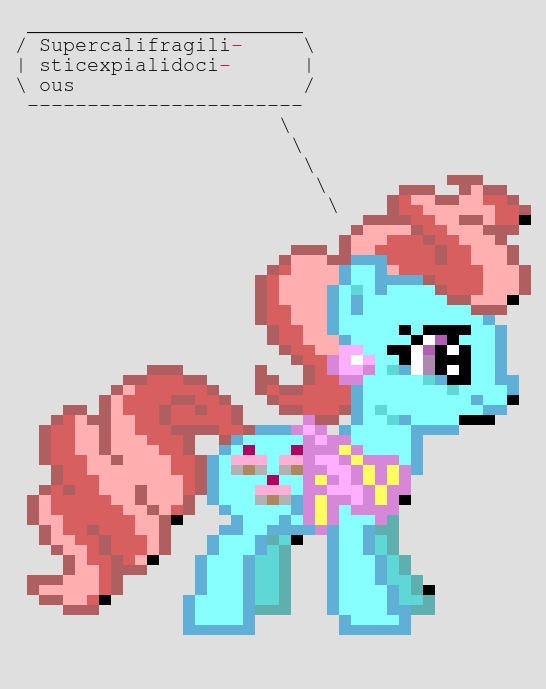

# Small pony stable of infinite wisdom

This project brings together [fortune](http://bxr.su/OpenBSD/games/fortune/), [ponysay](https://github.com/erkin/ponysay), [ansifilter](https://gitlab.com/saalen/ansifilter) and [ImageMagick](https://imagemagick.org/) libraries to
deliver to you the infinite pony wisdom art in PNG format.

## To build:

```
docker build -t oleyka/ponysay .
```

## To push:

```
docker push oleyka/ponysay
```

## To run:

```
docker run -v$(pwd):/out oleyka/ponysay
```

This drops a random pony fortune into file `pony.png` in your current directory. You might get something like this:


### Additional parameters:

The following optional parameters can be passed to the shell script:

```
-c|--count <number>:   amount of ponies to generate (default: 1)
-f|--font <fontname>:  use a custom font (default: FreeMono)
-q|--quote <phrase>:   phrase for pony to say (default: unset, use fortune)
-s|--size <number>:    specify a font size (default: 44)
                       font sizes affect the image size and the quality of a resulting image
                       known good values for the default font are: 14, 15, 44, 45, 46, 48
-w|--wrap <number>:    wrap text at a certain number of characters (default: 120)
```

__E.g.__ The following command:

```
docker run -v$(pwd):/out oleyka/ponysay -q Supercalifragilisticexpialidocious -s 15 -w 20
```

will produce a much smaller file (both bit-wise, because of the smaller font size, and width-wise), like shown below:


